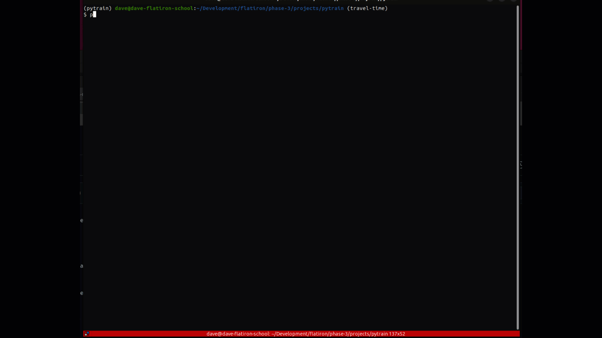

# PYTRAIN
PYTRAIN is a Python CLI tool that gives you a trip time estimate for a subway ride between two stations, or an arrival time for a train at one station.

## INSTALLATION
Clone the repository to your local machine. In the terminal, run the following commands...

run ``` pipenv install ```

run ``` pipenv shell ```

## RUN PYTRAIN
In the terminal type...

run ``` python ui.py ```

## INSTRUCTIONS
 


